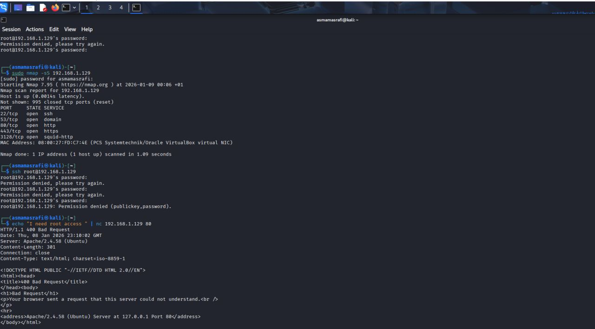
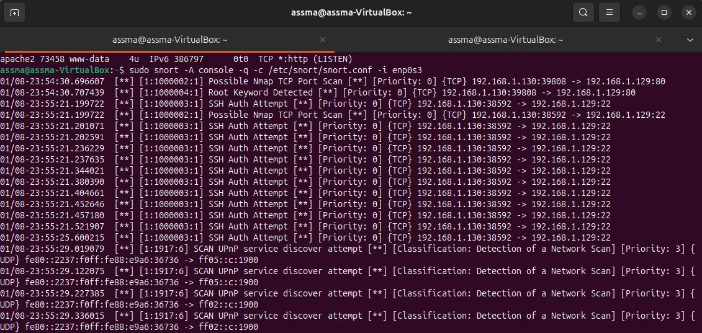

# 🛡️ Blue Team Lab — Network Intrusion Detection with Snort

This project demonstrates a practical **Blue Team network monitoring and intrusion detection workflow** using **Snort IDS** and a controlled **Kali Linux** environment.

The lab focuses on generating suspicious network activity, detecting it through custom Snort rules, and analyzing the resulting security alerts.

```text
                    CONTROLLED LAB
                          │
                          ▼
                  ┌───────────────┐
                  │  Kali Linux   │
                  │ Attack Source │
                  └───────┬───────┘
                          │
                 Suspicious Traffic
                          │
                          ▼
                  ┌───────────────┐
                  │   Snort IDS   │
                  │ Detection     │
                  └───────┬───────┘
                          │
                    Security Alerts
                          │
                          ▼
                  ┌───────────────┐
                  │ Blue Team     │
                  │ Investigation │
                  └───────────────┘
```

---

# 🎯 Lab Objectives

The main objective of this lab is to understand how an **Intrusion Detection System (IDS)** can be used to identify suspicious network activity.

The lab focuses on:

* 🔎 Network traffic monitoring
* 🛡️ Intrusion detection
* 📡 Packet inspection
* 🚨 Security alert generation
* 🧪 Custom Snort rule development
* 🔍 Detection analysis
* 🔵 Blue Team monitoring workflows

---

# 🔴 Attack Simulation

A controlled **Kali Linux** environment was used to generate suspicious network activity against the monitored host.

The simulated activities included:

* 🔎 Port scanning activity
* 🔐 Suspicious SSH authentication attempts

The objective was not to compromise a real system, but to generate representative network traffic that could be observed and detected by the IDS.

> ⚠️ **Lab scope:** All activity was performed against systems controlled as part of the security testing environment.

---

## 🐉 Kali Linux — Attack Simulation

The Kali Linux machine was used as the controlled source of simulated suspicious traffic.

The generated network activity was then observed by the Snort IDS.

```text
Kali Linux
    │
    ├── Port Scanning
    │
    └── SSH Authentication Activity
              │
              ▼
        Network Traffic
              │
              ▼
          Snort IDS
```

### 📸 Attack Simulation Evidence


---

# 🟢 Snort IDS Detection

**Snort** was configured as an **Intrusion Detection System (IDS)** to inspect network traffic and identify activity matching the configured detection rules.

Custom Snort rules were created to identify the simulated attack patterns.

## 🔄 Detection Workflow

```text
Network Traffic
      ↓
   Snort IDS
      ↓
 Packet Inspection
      ↓
  Custom Rules
      ↓
 Security Alerts
      ↓
Blue Team Investigation
```

The detection process demonstrates how suspicious network activity can be transformed into actionable security alerts.

---

## 📝 Custom Detection Rules

The lab uses custom Snort rules designed to identify specific suspicious traffic patterns.

The rules are intended to demonstrate:

* Detection logic
* Network traffic filtering
* Alert generation
* Signature-based intrusion detection

### 📸 Snort Detection Evidence

*Add screenshots showing Snort running and the generated alerts here.*

---

# 🔍 Detection Capabilities

The lab demonstrates detection of the following activities:

| Activity                                  | Detection  |
| ----------------------------------------- | ---------- |
| 🔎 Port scanning                          | ✅ Detected |
| 🔐 Suspicious SSH authentication activity | ✅ Detected |
| 📡 Network packet inspection              | ✅          |
| 📝 Custom Snort rules                     | ✅          |
| 🚨 Real-time security alerts              | ✅          |

---

# 🧪 Detection & Validation Workflow

The lab follows a simplified security testing methodology:

### 01 — Generate

Generate controlled suspicious network activity from Kali Linux.

### 02 — Monitor

Monitor the traffic received by the monitored host.

### 03 — Detect

Snort analyzes packets against the configured detection rules.

### 04 — Alert

Matching traffic generates security alerts.

### 05 — Investigate

The Blue Team analyzes the detected activity and determines its nature.

### 06 — Validate

The detection rules are tested again to confirm that the expected activity is detected.

```text
Generate
   ↓
Monitor
   ↓
Detect
   ↓
Alert
   ↓
Investigate
   ↓
Validate
```

---

# 🔵 Blue Team Perspective

This lab demonstrates a simplified **Blue Team detection workflow**.

```text
        Observe
           ↓
        Detect
           ↓
      Investigate
           ↓
        Analyze
           ↓
        Respond
```

The main focus is on the **Detection, Monitoring, and Investigation** stages of the cybersecurity incident lifecycle.

The lab also demonstrates an important SOC principle:

> **Detection rules are only useful when they produce meaningful alerts that can be investigated by defenders.**

---

# 📊 Security Monitoring Workflow

The complete lab workflow can be summarized as:

```text
┌───────────────────┐
│   Attack Source   │
│    Kali Linux     │
└─────────┬─────────┘
          │
          ▼
┌───────────────────┐
│ Network Activity  │
│ Port Scan / SSH   │
└─────────┬─────────┘
          │
          ▼
┌───────────────────┐
│     Snort IDS     │
│ Packet Inspection │
└─────────┬─────────┘
          │
          ▼
┌───────────────────┐
│ Custom Detection  │
│      Rules        │
└─────────┬─────────┘
          │
          ▼
┌───────────────────┐
│ Security Alerts   │
└─────────┬─────────┘
          │
          ▼
┌───────────────────┐
│ Blue Team         │
│ Investigation     │
└───────────────────┘
```

---

# 🛠️ Tools & Technologies

## 🔐 Security

* **Snort IDS**
* Custom Snort rules
* Network traffic analysis
* Intrusion detection
* Security alert analysis

## 🐧 Operating Systems

* **Kali Linux**
* **Linux**

## 🌐 Security Concepts

* Intrusion Detection
* Network Security
* Packet Inspection
* Security Monitoring
* Blue Team Operations
* Reconnaissance Detection
* Authentication Activity Monitoring

---

# 📸 Security Evidence

The project includes practical evidence collected during the attack simulation and detection phases.

Examples include:

### 🔴 Attack Simulation

* Kali Linux environment
* Simulated port scanning activity
* Simulated SSH authentication activity

### 🟢 IDS Detection

* Snort running in IDS mode
* Custom detection rules
* Generated security alerts
* Detected source and destination traffic

### 🔵 Blue Team Analysis

* Alert investigation
* Identification of suspicious activity
* Correlation between simulated activity and Snort alerts

> 📌 Screenshots can be added to this repository to document the complete detection workflow.

---

# 📈 Detection Results

The validation phase confirmed that the configured detection rules were able to identify the simulated suspicious activities within the controlled environment.

| Test Case                   | Expected Result                 | Result     |
| --------------------------- | ------------------------------- | ---------- |
| Port scanning               | Snort generates an alert        | ✅ Detected |
| SSH authentication activity | Snort generates an alert        | ✅ Detected |
| Packet inspection           | Suspicious traffic analyzed     | ✅          |
| Custom rule matching        | Matching traffic triggers alert | ✅          |

---

# 🎓 Learning Outcomes

This lab provided hands-on experience with:

* 🛡️ IDS configuration
* 📝 Snort rule creation
* 📡 Network traffic monitoring
* 🔎 Detection of reconnaissance activity
* 🔐 Detection of suspicious authentication activity
* 🚨 Security alert analysis
* 🔵 Blue Team monitoring workflows
* 🧪 Controlled attack simulation
* 🔍 Network security investigation

The project reinforced the relationship between **offensive simulation and defensive detection**:

```text
Attack Simulation
       ↓
Network Activity
       ↓
IDS Detection
       ↓
Security Alert
       ↓
Blue Team Investigation
```

---

# 🚀 Future Improvements

Potential extensions of the lab include:

## 🔎 Detection

* Add additional Snort detection rules
* Detect additional network attack patterns
* Improve rule specificity
* Add alert severity classification

## 📡 Network Analysis

* Integrate **Wireshark** for packet-level investigation
* Analyze suspicious packets in greater detail
* Correlate Snort alerts with network captures

## 🛡️ SOC Integration

* Forward Snort alerts to a **SIEM**
* Integrate the lab with **Splunk**
* Build a centralized security monitoring dashboard
* Correlate multiple security events

## 🤖 Automation

* Automate alert analysis
* Add automated incident enrichment
* Integrate threat intelligence
* Create automated response workflows

---

# ⚠️ Lab Scope & Ethics

This project was performed exclusively in a **controlled laboratory environment** for educational and cybersecurity training purposes.

The simulated activities were conducted only against systems under the control of the lab environment.

No unauthorized systems or third-party infrastructure were targeted.

---

# 📚 References

* **Snort Documentation**
* **Snort Rule Documentation**
* **Kali Linux Documentation**
* **OWASP**
* **MITRE ATT&CK**

---

# 👩‍💻 Author

**Assma MASRAFI**

Cybersecurity Engineering Student — **ENSA Agadir**

### Areas of Interest

`SOC` • `Blue Team` • `Threat Detection` • `SIEM` • `Network Security`

---

# ⭐ Project Focus

This lab demonstrates a practical defensive security workflow:

```text
🔴 Simulate
      ↓
📡 Monitor
      ↓
🛡️ Detect
      ↓
🚨 Alert
      ↓
🔍 Investigate
      ↓
🔵 Defend
```

**From simulated network activity to actionable IDS alerts.**
